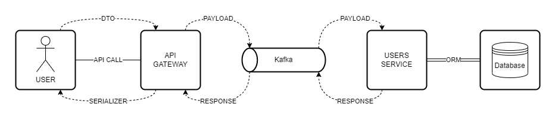

# Microservices POC

This project is a backend REST API for a simple microservice strategy created to demonstrate my abilities in backend development.

The API provides endpoints for managing users (get, create, update, and delete). It also includes a docker-compose file to deploy the Postgres database, Apache Kafka, Kafka UI and ReDoc using Docker containers.

The database is implemented using Postgres with TypeORM. The API is built using Node.js and NestJS, providing a scalable and robust solution for handling requests.

Overall, this project demonstrates my ability to design, develop, and deploy a backend API using modern and widely-used technologies.

## Architecture

This project is composed of two services:

1. API GATEWAY responsible to all external communications.
2. USERS SERVICE responsible to perform all actions related to the entity user.



## Technologies

- Transfer architecture

  - REST API
  - Messaging pattern with [Apache Kafka](https://kafka.apache.org/)

- Code organization

  - Monorepo with [Nx](https://nx.dev/)
  - Git

- Backend

  - Node.js
  - [NestJS Framework](https://docs.nestjs.com/)
  - TypeScript

- Database

  - Postgres with [Postgis](https://postgis.net/) extension
  - [TypeORM](https://typeorm.io/) (with transformers)

- Tests

  - Jest (>90% coverage)

- Documentation

  - [OpenAPI](https://www.openapis.org/)

- Others
  - Docker and Docker Compose
  - Prettier, ESLint
  - GeoJSON

## Postman collection and API documentation

A postman collection with automated data generation can be found at: [POC-MICROSERVICES.postman_collection.json](docs/postman/POC-MICROSERVICES.postman_collection.json)

An OpenAPI json file can be found at: [openapi-docs.json](apps/api-gateway/docs/openapi/openapi-docs.json)

## Tests

The services are tested at the controller level and the tests can be found at:

- API Gateway: [users.controller.spec.ts](apps/api-gateway/src/app/users/users.controller.spec.ts)
  - It uses a mock for the Apache Kafka defined at [client-kafka.mock.ts](apps/api-gateway/src/app/users/mocks/client-kafka.mock.ts)
- User service: [app.controller.spec.ts](apps/users-service/src/app/app.controller.spec.ts)
  - It uses a mock for the TypeORM repository defined at [user-repository.mock.ts](apps/users-service/src/app/mocks/user-repository.mock.ts)

| Service       | Command                     | Coverage |
| :------------ | :-------------------------- | :------- |
| API Gateway   | `npx nx test api-gateway`   | `>90%`   |
| Users service | `npx nx test users-service` | `>90%`   |

The coverage results can be found at `coverage/` directory.

Observations:

- The `10%` without coverage in API Gateway is from code used to control Kafka that does not needed to be mocked.
- The `10%` without coverage in Users service is from code used to deal with TypeORM exception for strange database errors and does not needed to be mocked.

## Running the code

```shell
npx nx serve users-service
npx nx serve api-gateway
```

The REST API will be available at `http://localhost:3333/api`

## Deploying

### Postgres and Apache Kafka (with UI)

```shell
docker compose up -d database zookeeper broker kafka-ui
```

Postgres will be available at port 5432 and configured with:

- User: postgres
- Password: 1234567890
- Database: postgres

Apache Kafka will be configured with:

- Broker at port 9092
- Kafka UI at port 8088

### Api-gateway and Users-service

First, it it necessary to build the Docker images for each service with the commands:

```shell
docker compose build base-image
docker compose build api-gateway
docker compose build users-service
```

`base-image` is a image with the node_modules folder. It is generate only one time to be used in all services build.

The services can be started with:

```shell
docker compose up -d api-gateway users-service
```

The REST API will be available at `http://localhost:3333/api`

### Documentation

```shell
docker compose up -d openapi
```

The REST API documentation will be available at `http://localhost:8080`
